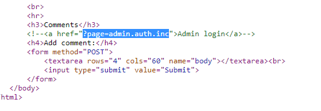
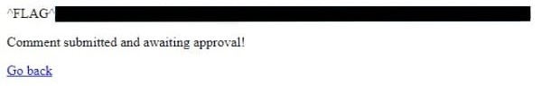

# Cody's First Blog - FLAG0

The contents written on the page indicates that it can’t communicate to outside world which means it has a localhost and PHP doesn’t need a template indicate it is written in PHP.

## Step 1 : Check Source Code

Check the source code of the page in order to know the backend of the page in which it was built and luckily we saw the way to reach to the admin page. I just copy paste the `?page=admin.auth.inc` in the url and redirected to the admin page.

## Step 2 : Exploit

Cool! Now the most common and exploitable security issue face by PHP is remote code execution. For this I just put a simple PHP script into the comment box `<?php echo “hello”; ?>` . This redirected to a new page with the flag.

