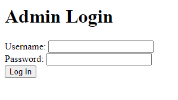
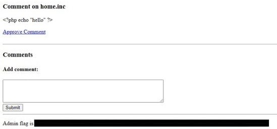

# Cody's First Blog - FLAG1

## Step 1 : Admin Page

Back to admin page the next thing that struck me is to crack the password and the username to get access as a root. I tried all the possible combinations but couldn’t get the one.

Then I just checked page source of admin page and again couldn’t get anything.

## Step 2 : Flag

I just looked at the url which was written as `?page=admin.auth.inc` . I did something extremely silly by removing **auth** from the url and rewrite it as `?page=admin.inc` and I was redirected to a new page.

