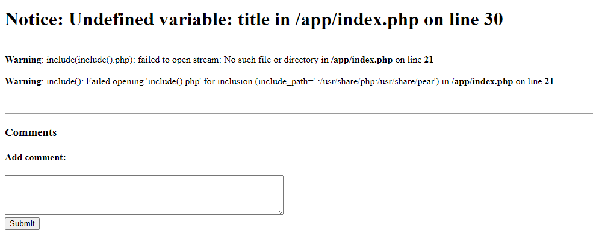
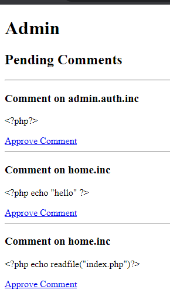
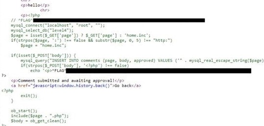

# Cody's First Blog - FLAG2

## Step 1 : include()

After going through the hints and reading the contents written on home page I saw the `include()`. This makes me think that PHP has an include() option and after gathering some information about it on Google which says that PHP does have an issue with it. So I tested this by modifying the URL as “?page=include()” I get an error and it took me to a new page.

## Step 2 : Adding Exploit

I felt I was on the right track so I just use the PHP blind injection trick to read the index file content and for this I comment a simple command as `<?php echo readfile(“index.php”) ?>` in the comment section on the home page. Nothing happened.

I realized I have to approve this statement as admin and now I have the access too of the admin portal. I approved it and go back I see I am still missing something.

## Step 3 : Flag

If I go back to `?page=http://localhost/index` and displaying all the comments that I have submitted. And if I look at the page source I can see all the PHP comments I have submitted and the flag.

