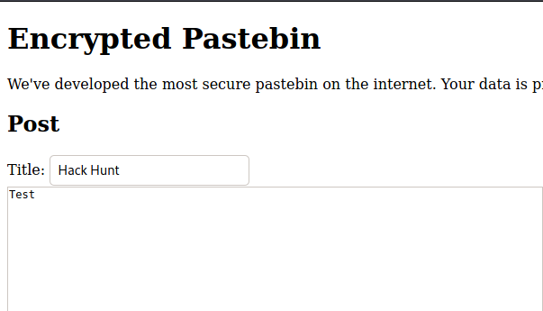
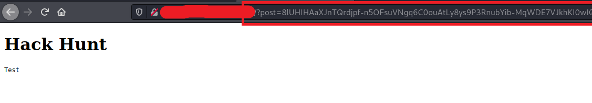
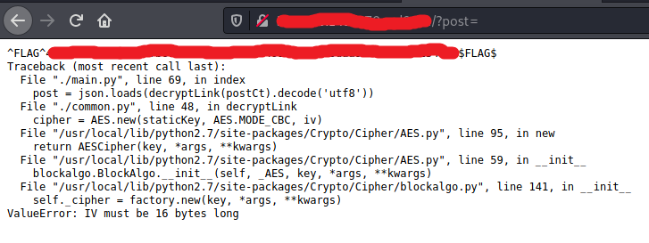

# Encrypted Pastebin - FLAG0

## Step 1 : Create Post

- Create a random post.

## Step 2 : Changing URL

- Submit the Request.
- There is a weird url.

## Step 3 : Flag

- Remove the value given to `post` variable.

**Background:** We are tampering the parameters in order to get any sensitive data any leakage. This can be solved in many other ways. We ourselves found more than 4 ways to get this flag. One by changing the value and another by decoding the URL parameter which looked like base64 and one through burp and the one which we mentioned above is the easiest one.
