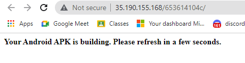
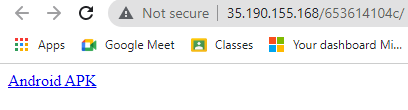
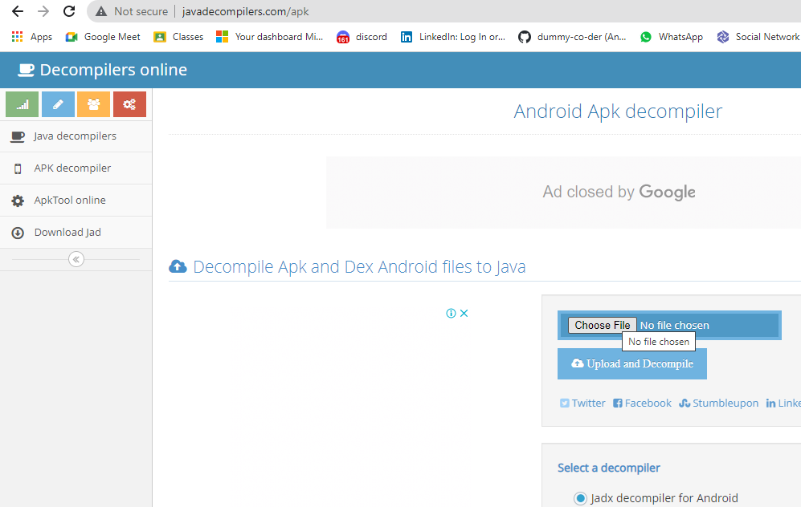
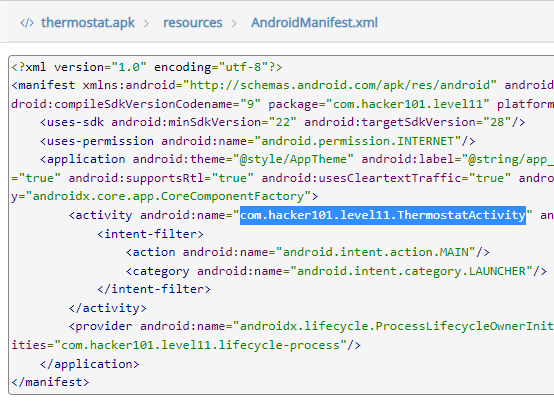
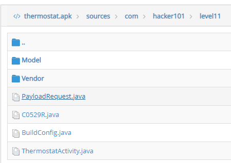
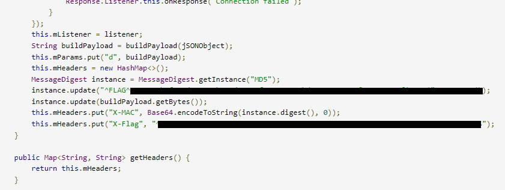

# H1 Thermostat - FLAG0 & FLAG1

## Step 1 : Download the APK

Reload the Page

## Step 2 : Decompile the APK

Visit the Website - [APK Decompiler](http://www.javadecompilers.com/apk)

Click on `Choose File` and select the APK you just download. Click on `Upload and Decompile`

## Step 3 : FLAG

You can see two options displaying as `resources` and `sources`. Go to on `resources`. Click on `AndroidManifest.xml`. We will see the location and the name of the android apk.

Now we have to do look for file in `com -> hacker101 ->  level11` as  `ThermostatActivity.jav`a to get the flags.

> Didn’t find anything.

Going through the code we saw the file `ThermostatActivity.java` is connected to `PayloadRequest.java` I just go back and click on the file.

Opening the file and scrolling it down, got  flag 1 and in the same file scrolling it a bit more you can see flag 2.

