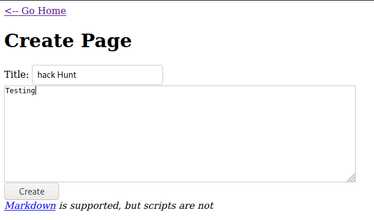
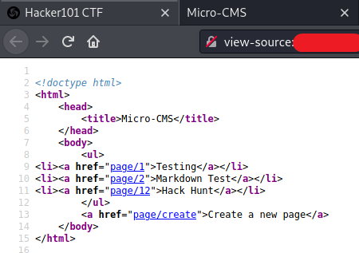
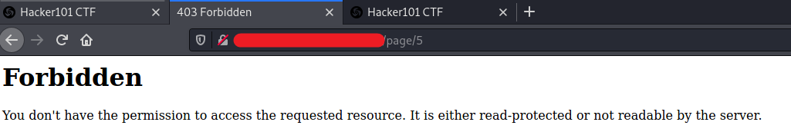
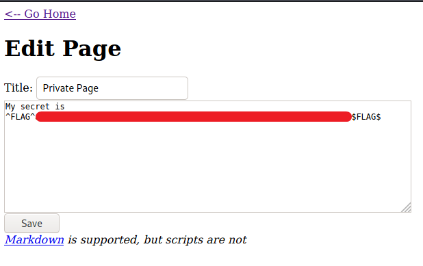

# Micro-CMS v1 - FLAG0

## Step 1 : Try creating a new page.

## Step 2 : How are pages indexed? / Look at the sequence of IDs

The page we created it number 12. So we have to try visiting the other pages manually.

## Step 3 : If the front door doesn't open, try the window

We get forbidden on page 5 which means that only authorized personnel can visit the page. We can bypass it by changing the endpoints.

## Step 4 : In what ways can you retrieve page contents? / FLAG

Let's try edit page.

**Background:** Here the developer has Restricted the users from accessing the sensitive information which are stored in the page number 5 but did not blocked the Edit option which makes it accessible to everyone. This lab tells us to search and hack every directory.
