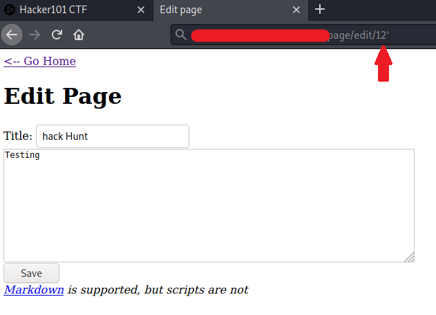
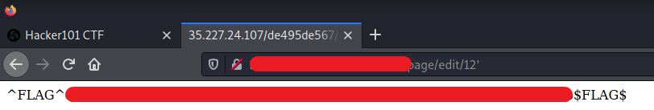

# Micro-CMS v1 - FLAG1

## Step 1 : Make sure you tamper with every input

Put a `'` mark in the url and reload the page.

## Step 2 : Flag

**Background:** Here the edit parameter was vulnerable to the SQL injection whenever we give `'` or `=` characters to the server and it throws an SQL error. There is very high chance that it is vulnerable to the SQL injection or even XSS. This lab insists us to check for SQL
