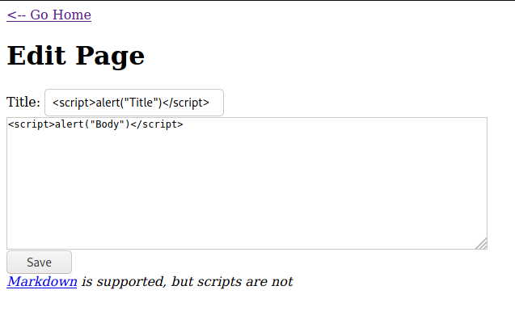
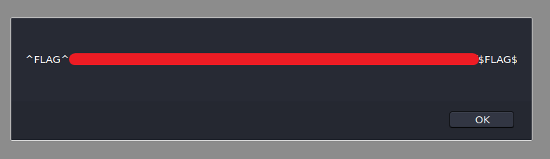

# Micro-CMS v1 - FLAG2

## Step 1 : Sometimes a given input will affect more than one page

Open the previous page, and edit the Title and Body with a XSS Payload -> ``

## Step 2 : The bug you are looking for doesn't exist in the most obvious place this input is shown

Go the home page.

## Step 3 : Flag

As soon as we navigate to our homepage the XSS payload gets executed.

**Background:** The website is vulnerable to stored XSS anything which is written in the comment boxes gets executed when we navigate to those page. You can see that in the place of page name our payload has been executed. This lab insists us to check for XSS wherever the user input is taken.
