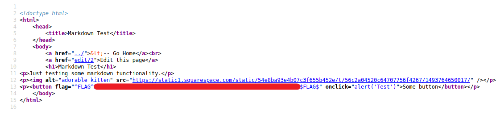

# Micro-CMS v1 - FLAG3

## Step 1 : Script tags are great, but what other options do you have?

Edit the button function with your JavaScript payload -> `onclick="alert(document.cookie)"`

Save it and open the source of the website.

**Background:** As the edit function is vulnerable to XSS. We could change the buttons functionality and could trick the users to give their sensitive information like credentials and cookies. XSS are quite Creative in nature.
