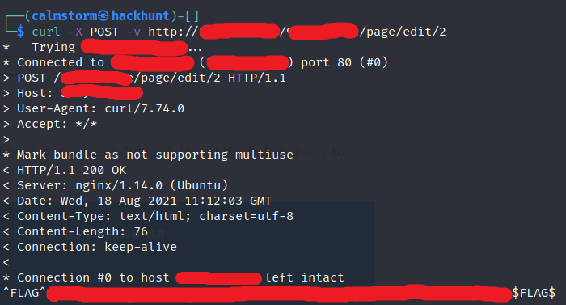

# Micro-CMS v2 - FLAG1

## Step 1 : Send Post Request

- Fire up the terminal and send the post request to the target using curl.

Command -> `curl -v -X POST http://x.x.x.x/x/page/edit/2`

## Step 2 : Flag

This will give all the headers and show you the response of the server.

**Background:** Many times the developers leave private API keys and other sensitive information like database version and others. This lab tells us the importance of viewing the response of a request. This can also be done in a proxy like burp or OWASP Zap.
